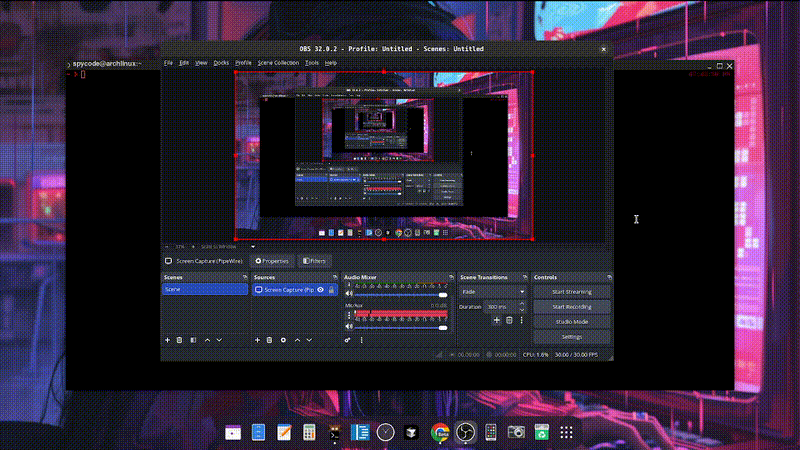

## 🏗️ Architecture Overview

The system follows a **layered architecture** with clear separation of concerns:

```javascript title="layered architecture"
┌─────────────────────────────────────────────┐
│         Presentation Layer (CLI)            │
│  Menu → MenuHandlers → ConsoleUI            │
└─────────────────────────────────────────────┘
                    ↓
┌─────────────────────────────────────────────┐
│         Business Logic Layer                │
│           Controllers                       │
└─────────────────────────────────────────────┘
                    ↓
┌─────────────────────────────────────────────┐
│         Data Access Layer                   │
│         Repositories                        │
└─────────────────────────────────────────────┘
                    ↓
┌─────────────────────────────────────────────┐
│         Data Storage Layer                  │
│         DataStore → JSON Files              │
└─────────────────────────────────────────────┘
```

## Design Principles

- **Single Responsibility**: Each class has one clear purpose
- **Separation of Concerns**: UI, business logic, and data access are isolated
- **DRY (Don't Repeat Yourself)**: Shared functionality is extracted to helpers
- **MVC Pattern**: Models, Controllers, and Views (CLI) are separated

---

## 📁 Folder Structure

```
maddington_library/
│
├── app.php                          # Application entry point
├── composer.json                     # Dependencies configuration
│
├── Core/
│   │
│   ├── CLI/                         # Presentation Layer
│   │   ├── Menu.php                 # Main menu navigation
│   │   ├── ConsoleUI.php            # UI helper utilities
│   │   │
│   │   └── Handlers/                # Menu action handlers
│   │       ├── BookMenuHandler.php
│   │       ├── MemberMenuHandler.php
│   │       ├── OtherResourceMenuHandler.php
│   │       └── BorrowTransactionMenuHandler.php
│   │
│   ├── Controllers/                 # Business Logic Layer
│   │   ├── BookController.php
│   │   ├── MemberController.php
│   │   ├── OtherResourceController.php
│   │   └── BorrowTransactionController.php
│   │
│   ├── Models/                      # Domain Models
│   │   ├── LibraryResource.php      # Base class for resources
│   │   ├── Book.php                 # Book entity
│   │   ├── Author.php               # Author entity
│   │   ├── OtherResource.php        # Other resource entity
│   │   ├── Member.php               # Member entity
│   │   └── BorrowTransaction.php    # Transaction entity
│   │
│   ├── Repositories/                # Data Access Layer
│   │   ├── DataStore.php            # Generic JSON file handler
│   │   ├── BookRepository.php
│   │   ├── MemberRepository.php
│   │   ├── OtherResourceRepository.php
│   │   └── BorrowTransactionRepository.php
│   │
│   └── data/                        # Data Storage (JSON files)
│       ├── books.json
│       ├── members.json
│       ├── otherResources.json
│       └── transactions.json
│
└── vendor/                          # Composer dependencies
    ├── php-school/cli-menu/         # Interactive CLI menus
    └── symfony/console/             # Console output styling
```


## Install Project Dependencies

```bash
cd /path/to/maddington_library
composer install
```

## Starting the Application

```bash
 php app.php
```

## Dependencies

- **php-school/cli-menu**: Interactive CLI menus
- **symfony/console**: Console output styling and formatting


## Github repository

::github{repo="dubanzl/maddington-library"}