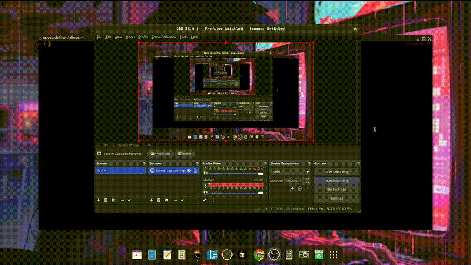

## 🏗️ Architecture Overviews

The system follows a **layered architecture** with clear separation of concerns:

```javascript title="layered architecture"
┌─────────────────────────────────────────────┐
│         Presentation Layer (CLI)            │
│  Menu → MenuHandlers → ConsoleUI            │
└─────────────────────────────────────────────┘
                    ↓
┌─────────────────────────────────────────────┐
│         Business Logic Layer                │
│           Controllers                       │
└─────────────────────────────────────────────┘
                    ↓
┌─────────────────────────────────────────────┐
│         Data Access Layer                   │
│         Repositories                        │
└─────────────────────────────────────────────┘
                    ↓
┌─────────────────────────────────────────────┐
│         Data Storage Layer                  │
│         DataStore → JSON Files              │
└─────────────────────────────────────────────┘
```

## Design Principles

- **Single Responsibility**: Each class has one clear purpose
- **Separation of Concerns**: UI, business logic, and data access are isolated
- **DRY (Don't Repeat Yourself)**: Shared functionality is extracted to helpers
- **MVC Pattern**: Models, Controllers, and Views (CLI) are separated

---

## 📁 Folder Structure

```
maddington_library/
│
├── app.php                          # Application entry point
├── composer.json                    # Dependencies configuration
├── composer.lock                    # Locked dependency versions
├── phpunit.xml                      # PHPUnit configuration
├── README.md                        # Project documentation
│
├── architecture/                    # Architecture diagrams
│   ├── cover.gif
│   └── POP_Diagram.png
│
├── Core/                            # Application core
│   │
│   ├── CLI/                         # Presentation Layer
│   │   ├── Menu.php                 # Main menu navigation
│   │   ├── ConsoleUI.php            # UI helper utilities
│   │   │
│   │   └── Handlers/                # Menu action handlers
│   │       ├── BookMenuHandler.php
│   │       ├── MemberMenuHandler.php
│   │       ├── OtherResourceMenuHandler.php
│   │       └── BorrowTransactionMenuHandler.php
│   │
│   ├── Controllers/                 # Business Logic Layer
│   │   ├── BookController.php
│   │   ├── MemberController.php
│   │   ├── OtherResourceController.php
│   │   └── BorrowTransactionController.php
│   │
│   ├── Models/                      # Domain Models
│   │   ├── LibraryResource.php      # Base class for resources
│   │   ├── Book.php                 # Book entity
│   │   ├── Author.php               # Author entity
│   │   ├── OtherResource.php        # Other resource entity
│   │   ├── Member.php               # Member entity
│   │   └── BorrowTransaction.php    # Transaction entity
│   │
│   ├── Repositories/                # Data Access Layer
│   │   ├── DataStore.php            # Generic JSON file handler
│   │   ├── BookRepository.php
│   │   ├── MemberRepository.php
│   │   ├── OtherResourceRepository.php
│   │   └── BorrowTransactionRepository.php
│   │
│   └── data/                        # Data Storage (JSON files)
│       ├── books.json
│       ├── members.json
│       ├── otherResources.json
│       └── transactions.json
│
├── tests/                           # Test Suite
│   ├── Unit/                        # Unit Tests (isolated)
│   │   ├── Models/
│   │   │   ├── BookTest.php
│   │   │   ├── MemberTest.php
│   │   │   └── BorrowTransactionTest.php
│   │   └── Repositories/
│   │       └── DataStoreTest.php
│   │
│   └── Integration/                 # Integration Tests (full workflow)
│       └── Controllers/
│           └── BookControllerTest.php
│
└── vendor/                          # Composer dependencies (auto-generated)
    ├── autoload.php                 # Composer autoloader
    ├── phpunit/phpunit/             # PHPUnit testing framework
    ├── php-school/cli-menu/         # Interactive CLI menus
    └── symfony/console/             # Console output styling
```


## Install Project Dependencies

```bash
cd /path/to/maddington_library
composer install
```

---

## 🐳 Docker Setup

### Prerequisites

- Docker installed on your system
- Docker Compose (optional, but recommended)

### Quick Start with Docker

#### Step 1: Build the Docker Image

```bash
# Build the Docker image
docker build -t maddington-library .

# Or with Docker Compose (recommended)
docker-compose build
```

#### Step 2: Access the Application (Interactive Console)

**This is a console application, so you access it directly in your terminal:**

```bash
# Method 1: Docker Compose (Recommended)
docker-compose up

# Method 2: Docker directly
docker run -it --rm maddington-library

#### Important Notes for Console App:

```bash
# Start in background
docker-compose up -d

# Attach to running container
docker attach maddington_library

# Or execute the app
docker exec -it maddington_library php app.php
```
---

## 🧪 Running Tests

### Install PHPUnit

PHPUnit is included in the `composer.json` as a dev dependency. Install it with:

```bash
composer install --dev
```

Or if you already installed dependencies:

```bash
composer update
```

### Run All Tests

Or using Composer:

```bash
composer test

```

Then open `coverage/index.html` in your browser.

### Test Structure

```
tests/
├── Unit/                          # Unit tests (isolated tests)
│   ├── Models/
│   │   ├── BookTest.php
│   │   ├── MemberTest.php
│   │   └── BorrowTransactionTest.php
│   └── Repositories/
│       └── DataStoreTest.php
│
└── Integration/                   # Integration tests (full workflow)
    └── Controllers/
        └── BookControllerTest.php
```
---

## Starting the Application

```bash
 php app.php
```

## Dependencies

- **php-school/cli-menu**: Interactive CLI menus
- **symfony/console**: Console output styling and formatting
